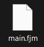

[](LICENSE)
[](https://esolangs.org/wiki/FlipJump)
[](https://pypi.org/project/c2fj/)

# c2fj
Compiling C --> RiscV --> [Flipjump](https://github.com/tomhea/flip-jump) --> .fjm

This compiler is a proof that any program can be compiled into a bunch of `NOT` operations. Read more about FlipJump: [Github](https://github.com/tomhea/flip-jump), [esolangs](https://esolangs.org/wiki/FlipJump).

An example program, [primes/main.c](tests/programs/primes/main.c):
```c
int main() {
    printf("Calculate primes up to: ");
    int max_number;
    scanf("%d", &max_number);
    
    ...
    
    for (int p = 3; p <= max_number; p += 2) {
        if (non_prime[p] == false) {
            for (int i = p*p; i <= max_number; i += p) {
                non_prime[i] = true;
            }
            printf("%d\n", p);
        }
    }
    
    return 0;
}
```
Compiled into this:


Which was compiled into this:


Which in turn compiled into:



Now, run it (Remember, these are flipjump ops that are running):

```text
Calculate primes up to: 20
2
3
5
7
11
13
17
19
Program exited with exit code 0x0.
```

# How to install
```
>>> pip install c2fj
>>> sudo apt install picolibc-riscv64-unknown-elf
```

# How to use

Simply `python3 c2fj.py file.c` will compile your c file into an elf, into fj files, into fjm, then run it.

`c2fj` supports the next flags:
- `--breakpoints` Place a fj-breakpoint at the start of the specified riscv addresses
- `--single-step` Place fj-breakpoints at the start of all riscv opcodes
- `--unify_fj` Unify the generated fj files into a single file
- `--finish-after` Stop the compilation at any step (before running, before creating fjm, etc.)
- `--build-dir` Save the builds in this directory

## What if my project is more then a single c?

We support specifying a `Makefile` path, instead of the c file!  
Your Makefile will have to rely on some constants that `c2fj` will fill:
```c
C2FJ_GCC_OPTIONS
C2FJ_LINKER_SCRIPT
C2FJ_SOURCES
C2FJ_INCLUDE_DIRS
ELF_OUT_PATH
```

An example Makefile:
```makefile
GCC := riscv64-unknown-elf-gcc
GCC_FLAGS := -O3

SOURCES := $(C2FJ_SOURCES) main.c globals.c calculate_int.c
OBJECTS := $(SOURCES:.c=.o)

all: |
	$(GCC) $(C2FJ_GCC_OPTIONS) $(GCC_FLAGS) $(SOURCES) -I $(C2FJ_INCLUDE_DIRS) -T $(C2FJ_LINKER_SCRIPT) -o $(ELF_OUT_PATH)

clean:
	rm -r build 2>/dev/null || true

.PHONY: clean all

```

You can also specify your own linker script. It should contain the following:
- `_stack_end` (just after the end of the stack)
- `_sdata` (start of the data section)
- `__heap_start` (start of the heap)

## How Does It Work?
First your C files are being compile to a RiscV elf.  
The compilation is done with [picolibc](https://github.com/picolibc/picolibc), and the project provides it any of the function implementation needed, in order for it to support the next phase of fj-compilation.

For example, look at `exit` ([c2fj_init.c](c2fj/compilation_files/c2fj_init.c)):

```c
void exit(int status) {
    asm volatile ("jal %0, .+10" ::"r"(status):"memory");
    __builtin_unreachable();
}
```

It uses jal with bad offset, thus will be parsed here as: ([riscv_instructions.py](c2fj/riscv_instructions.py))
```python
elif imm == JAL_EXIT_IMMEDIATE:
    return f'    .syscall.exit {register_name(rd)}\n'
```
Thus, will get to the flipjump implementation of: ([riscvlib.fj](c2fj/compilation_files/riscvlib.fj))
```python
def exit src_register {
    stl.output "Program exited with exit code "
    hex.print_uint 2, src_register, 1, 1
    stl.output ".\n"
    stl.loop
}
```

You can think of it like this: The C->RiscV compilation compiles the syscalls to a special (invalid) RiscV op, that gets parsed and further compiled into the fj implementation of the "requested syscall".
The supported syscalls can be found in [c2fj_init.c](c2fj/compilation_files/c2fj_init.c), and they contain `_getc`, `_putc`, `exit`, `sbrk`.

Every other opcode (Let's follow `addi x10, x11, 7` for example), will be compiled into itself.

The RiscV -> FlipJump part of the compilation parses the compiled elf, and matches each opcode with the appropriate flipjump macro. For example:  
```python
elif opcode == RV_ALU_IMM:
    if funct3 == RV_ADDI:
        ops_file.write(i_type('addi', full_op))
```

Then the `riscv.addi` macro is being used. The riscv ops macros are space-optimized. They are so much optimized, that each takes `30-40` fj-ops in space.  
That is by design. The space optimization allows this project to handle very large c code bases, and still being able to compile it without any problem.
That means that the compilation time doesn't really depend on the size of your codebase.

The way it works, is that each opcode is implemented once in the `riscv.start` macro. 
For example: 
```python
do_add:
    hex.add .HLEN, .rs1, .rs2
    stl.fret .ret
```
Note how `addi` is implemented:
```python
def addi mov_from_rs1, mov_to_rs1, imm < .do_add {
    .reg_imm_fast_op mov_from_rs1, mov_to_rs1, imm, .do_add
}

// Sets rs1 according to the given "fcall_label", rs2 to the given imm,
//  fcalls "do_op", then moves the result to the appropriate dst reg.
def reg_imm_fast_op mov_from_dest, mov_to_rs1, imm, do_op @ table, xor_imm_to_rs2, end < .ret, .zero_rs2, .rs2 {
    wflip .ret+w, table+dw, .ret

    pad 16
  table:
    .ret+dbit+2; do_op          // 4th
    .ret+dbit+1; mov_to_rs1     // 1st
    .ret+dbit+1; xor_imm_to_rs2 // 3rd
    .ret+dbit+0; .zero_rs2      // 2nd
    .ret+dbit+0; mov_from_dest  // 5th
    wflip .ret+w, table+5*dw, end   // 6th

  xor_imm_to_rs2:
    .__xor_by_hex_const .HLEN, .rs2, imm
    stl.fret .ret

  end:
}

def moves_to_from_middle_regs {
  zero_rs2:
    hex.zero .HLEN, .rs2
    stl.fret .ret
  ...
}
```

Most of the space goes on the two `wflip`s (total `@-4` ops).  
The line with `1st` is done first, `2nd` goes second, and so on. That's a compact way of doing multiple `fcall`s with a single pair of `wflip`s.  

So as you see, the macro gets a `mov_to_rs1` and `mov_from_dest` macros. For the example of the `addi x10, x11, 7`, the next macro names will be specified:
```python
ns riscv {
  mov_rs1_to_x10:
    hex.mov .HLEN, .regs.x10, .rs1
    stl.fret .ret

  mov_x11_to_rs1:
    hex.mov .HLEN, .rs1, .regs.x11
    stl.fret .ret
}
```
And the `addi x10, x11, 7` opcode will be compiled into `riscv.addi mov_rs1_to_x10, mov_x11_to_rs1, 7`.

So when the `1st` line is executed, the `mov_x11_to_rs1` code will be executed, and it will return to the start of the `2nd` line.  
Note that most of the macros use the global fj variables `rs1, rs2, rd` (part of the `riscv` namespace).  
Then, in the second line `rs2` is being zeroed.  
The third line xors the given immediate (`7`) to `rs2`, and the forth line does the actual addition (by jumping to `do_op` which is `do_add` in our case).  
The fifth line will move the result (which `do_add` puts in `rs1`) to `x10`, using the given `mov_rs1_to_x10` argument.  
Then, the macro will finish.

If you want to understand it better, feel free to _jump_ into the FlipJump and read how things work in the bits and bytes level.

The next phase uses the `flipjump` python package to compile the given `.fj` files into the compiles `.fjm` file (which is segments of data, and by data I mean bits of flips and jumps).  
The last phase, running the `.fjm` file, uses the `flipjump` package to interpret the `.fjm` file, and allows to debug it too.

#### Jumps Tables, Memory?
In the previous section I talked about the `ops.fj` file that was created in the compilation process, but there are two more files that gets created in that process too.

##### `mem.fj`:
The entire loadable memory of the compiled elf is being loaded into flipjump using this file. It contains all the loadable bytes of the memory in fj `hex` variables.  
There are no memory restrictions on it, thus the running program can read/write/execute from it freely.  
Note that the riscv opcodes are part of the loadable memory too, and you can modify that part of memory too, and it will change, but the compiled riscv-ops themselves (in `ops.fj`) won't change.

##### `jmp.fj`:
That's a jump table to every runnable riscv address. That helps us in jumping ops, because the macro addresses of the ops in the `ops.fj` can't be predicted easily.  
Think of how can you jump to address 0x144. The label `riscv.ADDR_00000144` in `ops.fj` is not in some fixed place, or something that related to `0x144`. Yet, the current;y running opcode ant to jump to address `0x144`. Then what do we do?  
Use a jump table! It looks something like:
```python
segment .JMP + 0x00000000/4*dw
;.ADDR_00000000
;.ADDR_00000004
...
;.ADDR_00000144
```
The `0x144` address is at fixed offset from the global `.JMP` address, thus jumping to riscv memory address `0x144` became as easy as jumping to fj-address `.JMP + 0x144*dw` (as `dw` is the length of one fj opcode, in bits).

## Tests

Simply run `pytest` to run the tests.
This package is tested on linux and python 3.13.

## Related projects
- [bf2fj](https://github.com/tomhea/bf2fj) - Brainfuck to FlipJump compiler.
- [FlipJump](https://github.com/tomhea/flip-jump) - The flipjump language macro assembler, standard library, and interpreter.
- [fji-cpp](https://github.com/tomhea/fji-cpp) - Faster C++ interpreter for FlipJump.
